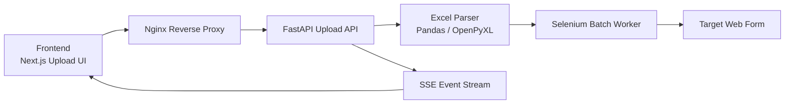

# massive-form-automation

Bulk-submit Excel records into a live web form through a containerized automation pipeline.  
Built with Next.js, FastAPI, Selenium, and Nginx to validate uploads, process records in controlled batches, and stream execution status in real time.


## 💡 Problem

Manual form submission from spreadsheets is slow, repetitive, and error-prone.  
When teams need to push dozens or hundreds of records into the same external form, they need automation, validation, and visibility, not copy-paste work.

## ⚡ Solution

This system turns an `.xlsx` file into a tracked automation job.  
Users upload the file from a web UI, the backend parses and normalizes each row, Selenium submits the target form, and the frontend receives live SSE updates for progress, success, and failure states.

## 🚀 Key Features

- 🚀 Excel upload workflow with `.xlsx` validation
- 📊 Real-time SSE progress streaming to the UI
- 🧠 Zone-based business rules for mapping, dates, and derived values
- ⚙️ Batch execution with throttling and one-driver-per-batch reuse
- 🌐 Single public URL through Nginx reverse proxy
- ⚡ Headless Chromium automation inside Docker
- 🔥 Single-job lock to prevent overlapping runs
- 🧩 Error capture with optional screenshots on failed submissions
- 🛠️ Docker-first deployment plus local manual mode
- 📦 Temporary file storage with cleanup after processing

## 🧩 Architecture



- ⚙️ Frontend: Next.js dashboard for file upload, headless toggle, progress bar, live results, and error reporting.
- ⚙️ Backend: FastAPI upload endpoint, Excel parsing, batch orchestration, Selenium driver lifecycle, and SSE streaming.
- ⚙️ Proxy: Nginx exposes one entry point, routes `/` to the frontend and `/api/` to FastAPI, and disables buffering for SSE.

## 📊 Processing Flow

`Upload -> Parse -> Normalize -> Automate -> Stream -> Clean Up`

1. Upload an `.xlsx` file from the Next.js UI.
2. `POST /api/upload/` sends `multipart/form-data` to Nginx.
3. Nginx forwards the request to FastAPI and keeps SSE buffering disabled.
4. FastAPI stores the file temporarily and acquires a global processing lock.
5. Pandas reads the workbook and converts rows into normalized records.
6. Selenium processes records in batches of `5`, applying zone-specific logic.
7. The backend streams progress and result events back to the UI.
8. The frontend updates progress, success/error state, and final status in real time.
9. The backend removes the uploaded file and releases the lock.

## 🛠️ Tech Stack

- 🛠️ Frontend: Next.js 15, React 18, TypeScript, Tailwind CSS, shadcn/ui, Framer Motion, React Hook Form, Zod
- 🛠️ Backend: FastAPI, Uvicorn, Selenium, Pandas, OpenPyXL, `python-multipart`
- 🛠️ Infra: Docker, Docker Compose, Nginx, Chromium, Server-Sent Events, `psutil`

## 📦 Project Structure

```text
CamilaProyecto/
├── backend/
│   ├── main.py                # Upload endpoint + SSE response
│   ├── selenium_worker.py     # Batch automation + zone logic
│   ├── excel_reader.py        # Excel parsing
│   ├── utils.py               # Date and email helpers
│   ├── config.py              # Runtime limits and browser settings
│   ├── monitor.py             # Resource monitoring / Chrome cleanup
│   ├── requirements.txt
│   └── Dockerfile
├── frontend/
│   ├── app/
│   ├── components/
│   ├── excel-processor.tsx    # Upload UI, progress, results
│   ├── package.json
│   └── Dockerfile
├── docker-compose.yml
├── nginx.conf
└── README.md
```

## 🌐 API

| Endpoint | Method | Purpose |
| --- | --- | --- |
| `/api/upload/` | `POST` | Main public route through Nginx |
| `/upload/` | `POST` | Direct FastAPI route on port `8000` |

- 🌐 Request type: `multipart/form-data`
- 📦 `file`: Excel file (`.xlsx`)
- ⚙️ `headless`: `true` or `false`
- 📊 Response type: `text/event-stream`
- 🧠 Streamed events: `inicio`, `batch_inicio`, `procesando`, `resultado`, `batch_pausa`, `error`, `error_batch`
- 🔥 Concurrency behavior: returns `409` if another job is already running

Example:

```bash
curl -X POST "http://localhost/api/upload/" \
  -F "file=@sample.xlsx" \
  -F "headless=true"
```

<details>
<summary><strong>📦 Excel Input Contract</strong></summary>

The backend expects these exact column names:

| Exact header | Meaning |
| --- | --- |
| `Nombre` | First name |
| `Apellido` | Last name |
| `Número Celular` | Phone number |
| `Zona` | Operational zone |
| `Es Primer Hijo` | `SI` or `NO` |
| `Fecha de Nacimiento` | Valid Excel date |

If a header does not match exactly, parsing will fail.

Example rows:

```csv
Nombre,Apellido,Número Celular,Zona,Es Primer Hijo,Fecha de Nacimiento
Camila,Rojas,987111111,LIMA,SI,2024-01-15
Mateo,Quispe,987222222,CUSCO,NO,2024-02-10
Valeria,Chavez,987333333,CHICLAYO,SI,2024-03-05
Luciano,Paredes,987444444,SELVA,NO,2024-04-20
Mariana,Delgado,987555555,LIMA,NO,2024-05-12
Thiago,Huaman,987666666,CUSCO,SI,2024-06-18
Ariana,Soto,987777777,PIURA,NO,2024-07-09
```

</details>

<details>
<summary><strong>🧠 Zone Logic and Routing Rules</strong></summary>

| Zone | Submitted code | Selected department |
| --- | --- | --- |
| `LIMA` | `LIMVMJ02` | `Lima (departamento)` |
| `LIMA 2` | `LIMVMJ02` | `Lima (departamento)` |
| `LIMA 3` | `LIMVMJ03` | `Lima (departamento)` |
| `LIMA 4` | `LIMVMJ04` | `Lima (departamento)` |
| `LIMA 6` | `LIMVMJ06` | `Lima (departamento)` |
| `CUSCO` | `CUSVMJ` | `Cusco` |
| `CHICLAYO` | `CIXVMJ` | `Lambayeque` |
| `AREQUIPA` | `AQPVMJ` | `Arequipa` |
| `TRUJILLO 1` | `TRUVMJ` | `La Libertad` |
| `TRUJILLO 2` | `TRUVMJ2` | `La Libertad` |
| `HUANCAYO` | `HCYOVMJ` | `Junín` |
| `ICA` | `ICAVMJ` | `Ica` |
| `MADRE DE DIOS` | `MDVMJ` | `Madre de Dios` |
| `SELVA` | `SELVMJ` | `Amazonas` |
| any other zone | `SELVMJ` | `Amazonas` |

Additional rules:

- 🧠 `LIMA`, `LIMA 2`, `LIMA 3`, `LIMA 4`, and `LIMA 6` generate a random date in `2025` up to today.
- 🧠 Non-Lima zones use `Fecha de Nacimiento` from the Excel file.
- 🧠 Lima zones always force the equivalent of the "first child" option.
- 🧠 Other zones respect the `Es Primer Hijo` value.
- 🧠 Email is generated automatically as `${Numero}@nogmail.com`.

</details>

<details>
<summary><strong>⚙️ Operational Defaults</strong></summary>

- ⚙️ Max records per upload: `200`
- ⚙️ Batch size: `5`
- ⚙️ Delay between batches: `3s`
- ⚙️ Delay between forms: `0.1s`
- ⚙️ Selenium timeout: `20s`
- 🌐 Target form: `https://survey.alchemer.com/s3/6972673/hospital-program-form`
- 📦 Temporary uploads: `backend/excel_files/`
- ⚡ Success condition: confirmation page contains `Thank You!`
- 🧩 Failed submissions attempt to save a screenshot in `/app/screenshots`

</details>

## ⚙️ How to Run

### Docker

Recommended path for the most stable setup.

Requirements:

- Docker Desktop running
- Docker Compose available

Start everything from the project root:

```bash
docker compose up --build
```

Open:

- `http://localhost` - full app
- `http://localhost:3000` - frontend directly
- `http://localhost:8000` - backend directly

Stop:

```bash
docker compose down
```

Logs:

```bash
docker compose logs -f backend
docker compose logs -f frontend
docker compose logs -f nginx
```

### Local

Requirements:

- Python `3.11`
- Node.js `18+`
- Google Chrome or Chromium
- ChromeDriver compatible with your local browser

Backend:

```bash
cd backend
python3 -m venv .venv
source .venv/bin/activate
pip install -r requirements.txt
uvicorn main:app --reload --host 0.0.0.0 --port 8000
```

Frontend:

```bash
cd frontend
npm install
npm run dev
```

Open:

- `http://localhost:3000`

Notes:

- ⚙️ The most reliable setup is Docker + Nginx.
- 🌐 The frontend calls `/api/upload/`, so separate frontend/backend local runs may still need an additional proxy layer.
- ⚡ Inside Docker, Chromium is forced to run in headless mode.

Optional monitoring:

```bash
cd backend
source .venv/bin/activate
python monitor.py monitor 60
python monitor.py clean
```

## 🔥 Why This Matters

- 🔥 This project shows real backend orchestration, not just a UI wrapper around a script.
- ⚙️ It combines file ingestion, normalization, browser automation, reverse proxying, and live event streaming in one workflow.
- 🧠 It encodes domain rules into deterministic automation paths instead of treating every record the same way.
- 🌐 It demonstrates practical systems thinking: SSE tuning, containerized execution, temporary storage, and concurrency protection.
- ⚡ It is strong portfolio evidence for backend, automation, integration, and operational reliability work.

## 🚧 Limitations

- 🚧 Only one active job is supported at a time through an in-memory lock.
- 🚧 The automation depends on the external form DOM staying stable.
- 🚧 There is no database or persistent job history yet.
- 🚧 Failures are reported, but retries are not automated.
- 🚧 Local split-mode development can require extra proxy configuration.
- 🚧 Authentication, authorization, and audit trails are not implemented.

## 🚀 Future Improvements

- 🚀 Replace the in-memory lock with Redis-backed queues and worker processes.
- 🚀 Persist jobs, row-level statuses, and artifacts in PostgreSQL or object storage.
- 🚀 Add retries, dead-letter handling, and resumable batches.
- 🚀 Scale with worker pools and rate-aware concurrency controls.
- 🚀 Add health checks, metrics, tracing, and structured logs.
- 🚀 Move browser execution into a dedicated worker service or grid.
- 🚀 Add stronger Excel schema validation and pre-flight linting.
- 🚀 Secure the platform with authentication and role-based access control.
